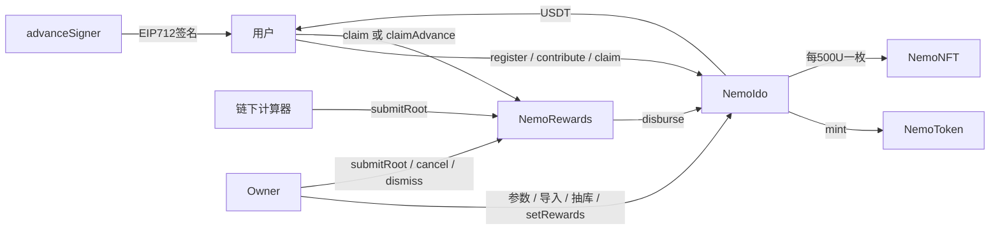
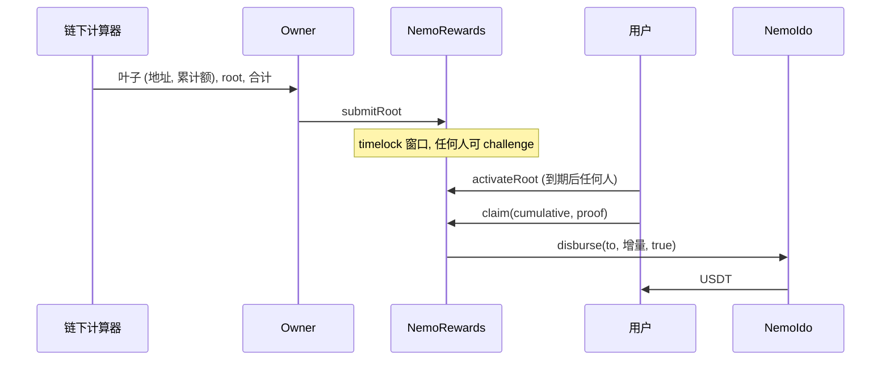

# nemoido 功能报告

日期：2026-09-23  
版本：链下网体结算（`localdev` 工作区，未提交）  
范围：`src/NemoIdo.sol`、`src/NemoRewards.sol`、`src/INemoRewards.sol`、`src/NemoToken.sol`、`src/NemoNFT.sol`、`src/network/NemoNetworks.sol`、`src/MockUSDT.sol`，部署脚本，链下计算与导入脚本。  
配套安全报告：[SECURITY-AUDIT-2026-09-23.md](SECURITY-AUDIT-2026-09-23.md)

---

## 1. 系统总览

金库只处理入金、邀请、直推、铸币和导入。多级网体奖在链下计算，链上用累计 Merkle root 定权，EIP-712 签名只能垫付 root 之上的增量。



### 1.1 信任边界

| 角色 | 能做什么 | 不能做什么 |
|------|----------|------------|
| 用户 | 注册、绑定、入金、领直推、领网体奖、挑战待生效 root | 改别人的数据；绕过 25% 帽 |
| Owner（金库） | 导入、开关售、暂停、调参数、抽走非准备金、换 rewards 地址 | 直接抽走直推准备金 |
| Owner（奖励合约） | 提交 root、撤销待生效 root、裁决挑战、换签名人 | 跳过 timelock；让网体累计超过 25% 帽 |
| advanceSigner | 签发垫付凭证 | 突破单账户日帽和全站日帽 |
| 链下计算器 | 读链上事件、算累计网体奖、组 Merkle 树 | 本身没有链上权限，结果要经 Owner 提交 |
| 任何人 | `activateRoot`（到期且无挑战时） | — |

---

## 2. 合约函数表

### 2.1 NemoIdo（金库）

继承 `Ownable2Step`、`Pausable`、`ReentrancyGuard`。

**用户**

| 函数 | 门禁 | 状态变化 | 事件 |
|------|------|----------|------|
| `register(code, referrerCode)` | `whenNotPaused` | 写邀请码、`registered`；可选绑定上级、`hasChildren[上级]` | `Registered` |
| `bindReferrer(referrerCode)` | `whenNotPaused`；已注册且未绑定；自己没有下级 | 写 `referrer` | `ReferrerBound` |
| `contribute(amount)` | `whenNotPaused` + `nonReentrant`；已开售、已注册、≥ `minIdo` | 收 USDT、`selfVolume`、`totalContributed`；可能记直推；mint NEMOKEY 和 NFT | `Contributed`、`DirectRewardAccrued`、`NemoAllocated`、`NftMinted` |
| `registerAndContribute(...)` | 同上 | 未注册时先注册，再入金。已注册时忽略传入的邀请码 | 同上 |
| `claim()` | `whenNotPaused` + `nonReentrant` | `claimed`、`totalClaimed`，转出直推 USDT | `Claimed` |

**奖励合约**

| 函数 | 门禁 | 说明 |
|------|------|------|
| `disburse(to, amount, fromOutstanding)` | `msg.sender == rewards` + `nonReentrant` | 锁定额 = 直推准备金；垫付（`fromOutstanding=false`）时再加上当期 outstanding。余额不足时 revert |

**Owner**

| 函数 | 说明 |
|------|------|
| `importUsers` / `importReferrers` / `importVolumes` | 冻结前可调。只写用户、邀请和本人业绩；`nftMinted = self / 500`，不补铸 |
| `freezeImport` / `openSale` / `closeSale` | 开售必须先冻结导入 |
| `pause` / `unpause` | 挡住注册、入金、直推领取；**不挡** `disburse` |
| `withdrawTreasury(to, amount)` | 最多提走 `balance - reservedRewards` |
| `withdrawUnsoldNemo` | 取回金库持有的 NEMOKEY（正常流程下为 0） |
| `setDirectReferralBps` | ≤ 2500 |
| `setMinReferralAmount` / `setMinIdo` / `setIdentityThresholds` | 门槛参数 |
| `setRewards(addr)` | 换奖励合约地址，随时生效，没有延迟 |
| `setTokensPerUsdt` / `setNemoSchedule` / `setNemoBonus` | 铸币汇率；周递减只影响 `quote()` 视图 |

**视图**：`getAccount`、`pendingOf`、`referrerOf`、`directReserve`、`reservedRewards`、`treasuryWithdrawable`、`roleOf`、`currentWeek`、`tokensPer100`、`tokensFor`、`nftRemainder`、`quote`。

### 2.2 NemoRewards（网体奖）

继承 `Ownable2Step`、`EIP712("NemoRewards","1")`、`ReentrancyGuard`。不持有奖金 USDT，只持有挑战押金。

| 函数 | 调用方 | 说明 |
|------|--------|------|
| `submitRoot(root, contentHash, cumulative)` | Owner | 要求 `cumulative ≥ totalTeamPaid`，且直推 + `cumulative` ≤ 25% 帽。覆盖旧的待生效 root，并退回其挑战押金。计时 `rootTimelock` |
| `challenge()` | 任何人 | 在 eta 之前、且没人挑战时，押 `challengeBond` USDT |
| `cancelPending()` | Owner | 撤销待生效 root，退押金 |
| `dismissChallenge()` | Owner | 驳回挑战，押金转给 Owner |
| `activateRoot()` | 任何人 | 到期、无挑战、仍满足累计额和帽的检查时，生效 |
| `claim(cumulative, proof)` | 用户 | 验证叶子，付 `cumulative - claimed`；已经垫付过的部分只入账不转账 |
| `claimAdvance(cumulative, deadline, sig)` | 用户 | 验证签名、nonce 和 deadline，付增量，受单账户日帽和全站日帽限制 |
| `setAdvanceSigner` | Owner | 换签名人 |

视图：`outstanding()`、`rewardCap()`、`advanceDigest(...)`。

### 2.3 NemoToken

`nemokey / NEMOKEY`，18 位，`CAP = 1e9 * 1e18`，无预铸。

- `mint`：金库（minter）或 Owner。
- 转账：`from` 或 `to` 至少一方在 `transferAllowlist` 才放行；mint 和 burn 不受限。
- `pause`：同时停转账和 mint。暂停期间入金会 revert。
- `rescue`：取回误转入的其他代币，不能取本代币。

### 2.4 NemoNFT

- 仅 minter（金库）可 `mint(to, count)`，按枚循环，`tokenId` 自增。
- `_update` 禁止两个非零地址之间转移，灵魂绑定。

### 2.5 NemoNetworks

纯函数库，部署时传入参数；`NemoIdo` 和 `NemoRewards` 的构造函数都校验 `block.chainid`。

| 参数 | local 31337 | bscTestnet 97 | bscMainnet 56 |
|------|-------------|---------------|---------------|
| USDT | 部署 MockUSDT | 部署 MockUSDT | `0x55d398326f99059fF775485246999027B3197955` |
| rootTimelock | 60 秒 | 1 小时 | 24 小时 |
| challengeBond | 1 USDT | 10 USDT | 100 USDT |
| 单账户日垫付帽 | 1,000 | 500 | 1,000 |
| 全站日垫付帽 | 100,000 | 50,000 | 100,000 |
| 周 | 30 区块 | 1 小时 | 7 天 |
| 直推 / 最低入金 / 直推门槛 | 10% / 1 / 100 | 同左 | 同左 |
| NEMOKEY 汇率 | 1U → 100 | 同左 | 同左 |

---

## 3. 资金流与准备金

```
入金 amount → 金库余额 += amount
  直推：directRewards[上级] += amount × 10%（amount ≥ 100U）
直推领取 claim() → 金库转出
网体领取 → NemoRewards → vault.disburse → 金库转出
Owner 抽库 withdrawTreasury ≤ balance − reservedRewards
```

- `directReserve = totalDirectAccrued − totalClaimed`
- `outstanding = committed − rootPaid`（当期 root 还没被证明领走的部分）
- `reservedRewards = directReserve + outstanding`

**不在准备金里的：** 待生效 root 的金额；链下已经算出、还没提交 root 的网体奖。它们是否有钱可付，取决于 Owner 没有提前抽库。详见安全报告 M-1、M-2。

**25% 帽：** `totalDirectAccrued + totalTeamPaid ≤ totalContributed × 25%`。`submitRoot`、`activateRoot`、每次网体付款都检查。常量，没有 setter。

---

## 4. 网体结算生命周期



### 4.1 累计记账

| 变量 | 含义 |
|------|------|
| `claimed[a]` | 已经转给 a 的网体 USDT（Merkle + 垫付） |
| `rootAttributed[a]` | a 已证明过的最高叶子累计额 |
| `committed` | 当期 root 的累计合计（Owner 申报） |
| `rootPaid` | `committed` 中已由证明归因的部分，包括垫付过、这次只入账的金额 |
| `totalTeamPaid` | 全站网体已转出总额 |

`claim` 的处理顺序：

1. 叶子累计额低于 `rootAttributed` 时 revert。
2. `pay = max(0, cumulative − claimed)`，检查 25% 帽。
3. `span = cumulative − rootAttributed`，`rootPaid += span`（其中 `span − pay` 是垫付过、只入账的部分）。
4. `pay > 0` 时 `disburse(..., true)`。

`claimAdvance` 只加 `claimed` 和 `totalTeamPaid`，不动 `rootPaid`。所以垫付的钱要等用户之后提交证明，才会从 `outstanding` 里扣掉。

### 4.2 垫付凭证

EIP-712 类型：`Advance(address account,uint256 cumulative,uint256 nonce,uint256 deadline)`，域为 `NemoRewards` / `1` / chainId / 合约地址。每个账户的 nonce 顺序递增。单账户额度和全站额度都按 `block.timestamp / 1 days` 的自然日重置。

---

## 5. 链下计算

`scripts/lib/team-reward.mjs`，口径与已删除的链上模块一致：

- 资格 = 本人 + 伞下，费率取本笔 bump 之前的资格。
- 入金者自己的档位不压缩上级，`prevBps` 从 0 起。
- 档位：500/3%、2k/5%、1 万/7%、3 万/9%、6 万/10%。
- 极差走完后，只做一份 6 万平级抽成，给最近的 10% 祖先，不跳级。

`scripts/fixtures/team-golden.json` 冻结 ABCD 和平级抽成数字，`npm run test:js` 回归。

`scripts/lib/merkle.mjs` 采用 OpenZeppelin 双哈希叶子、排序配对、奇数节点上提。多叶子证明已在 Anvil 上被合约接受。

---

## 6. 部署与导入

| 入口 | 作用 |
|------|------|
| `script/Deploy.s.sol` | `NETWORK=local\|bscTestnet\|bscMainnet`。主网需 `ALLOW_MAINNET=true` 才广播 |
| `script/DeployLocal.s.sol` | 固定 local |
| `script/SeedLocal.s.sol` | 冻导入、开售、注册 `ROOTANVL` |
| `scripts/export-freedao.mjs --network` | local / bscTestnet 用 `keccak("nemo-sim:网络:用户id")` 派生地址，写对照表；主网保留真实钱包 |
| `scripts/import-onchain.mjs` | 批量导入用户、邀请、本人业绩；`--freeze` 可顺手冻结 |
| `scripts/scale-network.sh` / `scale-anvil.mjs` | 数百人实跑；测试网缺密钥时只打印说明 |

部署注意：`OWNER` 不是广播账户时，脚本不会调用 `setRewards`，Owner 需要自己调用；NEMOKEY 和 NFT 的 `transferOwnership` 需要新 Owner `acceptOwnership`（Ownable2Step）。`ADVANCE_SIGNER` 不设时默认是部署账户。

---

## 7. 运维职责

**用户：** 领直推调用 `NemoIdo.claim()`。领网体奖由前端提供累计额和 proof，调用 `NemoRewards.claim`；需要当天拿钱时，用签名调用 `claimAdvance`。自己付 gas。

**管理员：**

1. 定时从已最终确认的区块读取 `Registered`、`ReferrerBound`、`Contributed` 等事件，按（区块号，logIndex）排序，交给计算器。
2. 组 Merkle 树，发布叶子 JSON，把哈希作为 `contentHash`，调用 `submitRoot`。
3. 到期后任何人都可以调用 `activateRoot`。
4. 出现挑战时，人工决定 `cancelPending` 还是 `dismissChallenge`。
5. 签名服务按链下余额和额度签发垫付。

步骤 1–3 和 5 可以全部写成定时任务。漏跑时不用逐日补：下一期 root 用累计额，一次把缺的周期补齐。

---

## 8. 测试与实测

| 项 | 结果 |
|----|------|
| Forge（不含跳过的 SimMarket） | 84 项通过；加上审计 PoC 共 93 项 |
| 覆盖率（行 / 分支） | NemoIdo 88.7% / 43.8%；NemoRewards 91.2% / 43.9%；NemoToken 100% / 50%；NemoNFT 100% / 33.3% |
| JS | 13 项通过（极差 golden、Merkle、地址映射、导入树） |
| 300 人 Forge 场景 | 深链与浅链入金 gas 差 &lt; 80k |
| 300 人 Anvil 实跑 | 299 笔入金；1000U 入金 gas 270,271，深浅一致；垫付后再 Merkle 领取不双付；多叶子 proof 被合约接受 |
| NFT 开销 | 每 500U 一次 mint；6 万 U 单笔约 120 次，历史实测约 341 万 gas |

分支覆盖率偏低，主要是没有测到的 revert 分支（零地址、长度不匹配、参数越界）。安全报告第 6 节列出了应补的测试。

---

## 9. 本期不做

zkVM 证明、接入 UMA、NFT 批量铸造、董事 1% / 33 席 / 脱离制、正式币兑换、广播 BSC 主网。
