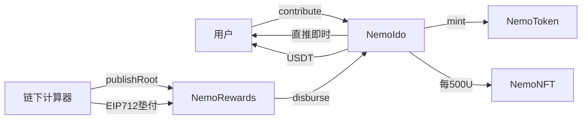

# nemoido — nemokey IDO（BSC USDT 金库）

金库只做入金、邀请、直推、铸币和导入。多级奖金在链下按经典极差计算，链上用累计 Merkle root 定权，EIP-712 签名只垫付尚未结算的增量。

完整结构见 [ARCHITECTURE.md](ARCHITECTURE.md) 和 [FUNCTIONAL-REPORT.md](FUNCTIONAL-REPORT.md)。当前审计见 [SECURITY-AUDIT-2026-09-23.md](SECURITY-AUDIT-2026-09-23.md)；[SECURITY-AUDIT.md](SECURITY-AUDIT.md) 是上一版「链上遍历发奖」的内部审查，不是本结构的修复声明。主网仍需要外部审计，本期不广播主网。

仓库是独立 Foundry 项目。网站整合为后续工作。`NemoIdo.claim()` 只领 **USDT 直推**。网体奖走 `NemoRewards`。

---

## 合约分工



| 合约 | 功能 |
|------|------|
| `NemoIdo` | 邀请、入金、直推 10%、NEMOKEY / NFT、导入、金库抽走。不沿邀请链循环 |
| `NemoRewards` | 累计 Merkle 领取、EIP-712 垫付、25% 全局帽、root timelock、押金挑战。不持有奖金 USDT |
| `NemoToken` | `nemokey / NEMOKEY`，CAP **10 亿**，默认禁转，Owner 可开转账白名单 |
| `NemoNFT` | 本人业绩每 **500 USDT** 一枚，禁止转让。单笔仍按枚铸造 |

直推 + 已支付网体奖不得超过 `totalContributed` 的 25%（`REWARD_CAP_BPS = 2500`，没有管理员 setter）。

---

## 三套网络参数

`src/network/NemoNetworks.sol`。构造函数要求 `block.chainid` 与参数一致。

| | local `31337` | BSC 测试网 `97` | BSC 主网 `56` |
|--|--|--|--|
| USDT | 部署 MockUSDT | 部署 MockUSDT | `0x55d398326f99059fF775485246999027B3197955` |
| root timelock | 60 秒 | 1 小时 | 24 小时 |
| 挑战押金 | 1 USDT | 10 USDT | 100 USDT |
| 单账户垫付帽 | 1,000 USDT | 500 USDT | 1,000 USDT |
| 每日垫付帽 | 100,000 USDT | 50,000 USDT | 100,000 USDT |
| 周 | 30 个区块 | 1 小时 | 7 天 |

`quote()` 仍是历史周递减公式，**入金不使用**。实发 NEMOKEY 为 `amount * tokensPerUsdt / 1e18`，默认 1U → 100 枚。

---

## 规则

| 项 | 口径 |
|----|------|
| 直推 | 链上即时。10% 给直接推荐人；入金 ≥ 100U 才发。推荐人不必自己已入金 |
| 入金 &lt; 100U | 计入本人业绩，无直推。NEMOKEY / NFT 仍按规则发 |
| 网体奖 | 链下。资格 = 本人 + 伞下；档位用 bump 前业绩；入金者自己的档位不压缩上级 |
| 档位 | 500→3%，2k→5%，1 万→7%，3 万→9%，6 万→10% |
| 6 万平级 | 最近一个 10% 祖先拿 D 本笔团队奖的 10%（不含直推）。只抽一份，不跳级 |
| 身份 | 探索者 / 大使 ≥100 / 合伙人 ≥1000。共建者需要伞下业绩，只在链下计算器里 |
| NFT | `floor(selfVolume / 500)` 枚。6 万 U 仍是约 120 次 mint |

邀请码：1–32 位大写字母或数字，`bytes32` ASCII 左对齐。已有下级的地址不能再绑上级。

导入只写用户、邀请和本人业绩，不发直推、不发网体奖、不补铸 NFT。网体奖只从导入之后的新入金，用 `scripts/lib/team-reward.mjs` 计算。

---

## 领奖

1. 用户 `claim()` 领直推，随时可领。
2. 运营用链下计算器产出叶子 `(地址, 累计网体奖)`，调用 `submitRoot(root, contentHash, 累计合计)`。
3. 挑战窗内任何人可押 USDT `challenge()`。Owner 可 `cancelPending()`（退押金）或 `dismissChallenge()`（押金给 Owner）。
4. 窗过且无人挑战后 `activateRoot()`。用户 `claim(cumulative, proof)` 只领累计额里还没拿到的增量。
5. 签名垫付 `claimAdvance` 可以先付未进 root 的增量，但不得超过单账户帽和每日帽。下一期 root 的累计额必须 ≥ 已领取额，否则不能再领，避免双付。

---

## 命令

```bash
bash scripts/install-deps.sh
forge build
forge test
npm install
npm run test:js

anvil --chain-id 31337
bash scripts/local-up.sh
node scripts/scale-anvil.mjs
```

`NETWORK=local|bscTestnet|bscMainnet`。主网脚本在没有 `ALLOW_MAINNET=true` 时拒绝广播。本期不要设这个变量。

```bash
# 测试网：没有下面两个变量时不会广播
NETWORK=bscTestnet BSC_TESTNET_RPC=... PRIVATE_KEY=0x... bash scripts/scale-network.sh

# 主网只准备脚本，不广播
NETWORK=bscMainnet forge script script/Deploy.s.sol:Deploy --sig "run()" 
```

若 `OWNER` 不是广播账户，部署后由 Owner 自己调用 `NemoIdo.setRewards`。

---

## 历史导入

`--network bscMainnet` 使用库里的真实钱包。`local` 和 `bscTestnet` 按用户 id 派生模拟地址，树和业绩不变，并写出地址对照表。

```bash
DATABASE_URL=postgres://... node scripts/export-freedao.mjs --network bscMainnet --out import-data.json
node scripts/export-freedao.mjs --in scripts/fixtures/sample-users.json --network local --out import-data.json

IDO_ADDRESS=0x... RPC_URL=http://127.0.0.1:8545 PRIVATE_KEY=0x... \
  node scripts/import-onchain.mjs --in import-data.json
IDO_ADDRESS=0x... RPC_URL=... PRIVATE_KEY=0x... \
  node scripts/import-onchain.mjs --in import-data.json --apply --freeze
```

---

## 安全

当前版本的内部审计：[SECURITY-AUDIT-2026-09-23.md](SECURITY-AUDIT-2026-09-23.md)（1 高 / 3 中 / 6 低，均为特权角色或可用性风险，复现在 `test/audit/AuditPoc.t.sol`）。功能说明：[FUNCTIONAL-REPORT.md](FUNCTIONAL-REPORT.md)。

[SECURITY-AUDIT.md](SECURITY-AUDIT.md) 审查的是已经删掉的链上团队模块，不要把它读成「本版已修复」。主网部署前需要外部审计。

历史第一期笔记：[docs/SECURITY.md](docs/SECURITY.md)（口径已过时）。

---

## 本地账户（Anvil 默认助记词，禁止用于主网）

`test test test test test test test test test test test junk`

| 账户 | 地址 |
|------|------|
| #0 | `0xf39Fd6e51aad88F6F4ce6aB8827279cffFb92266` |
| #1 | `0x70997970C51812dc3A010C7d01b50e0d17dc79C8` |
| #2 | `0x3C44CdDdB6a900fa2b585dd299e03d12FA4293BC` |

根邀请码：`ROOTANVL`。

---

## Git 作者

本仓库提交身份固定为 **`freedaocrypto <jackoelv@freedao.life>`**（[`.gitconfig`](.gitconfig)）。克隆后执行一次：

```bash
bash scripts/setup-git-author.sh
```
